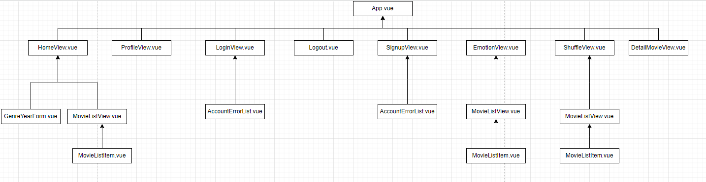
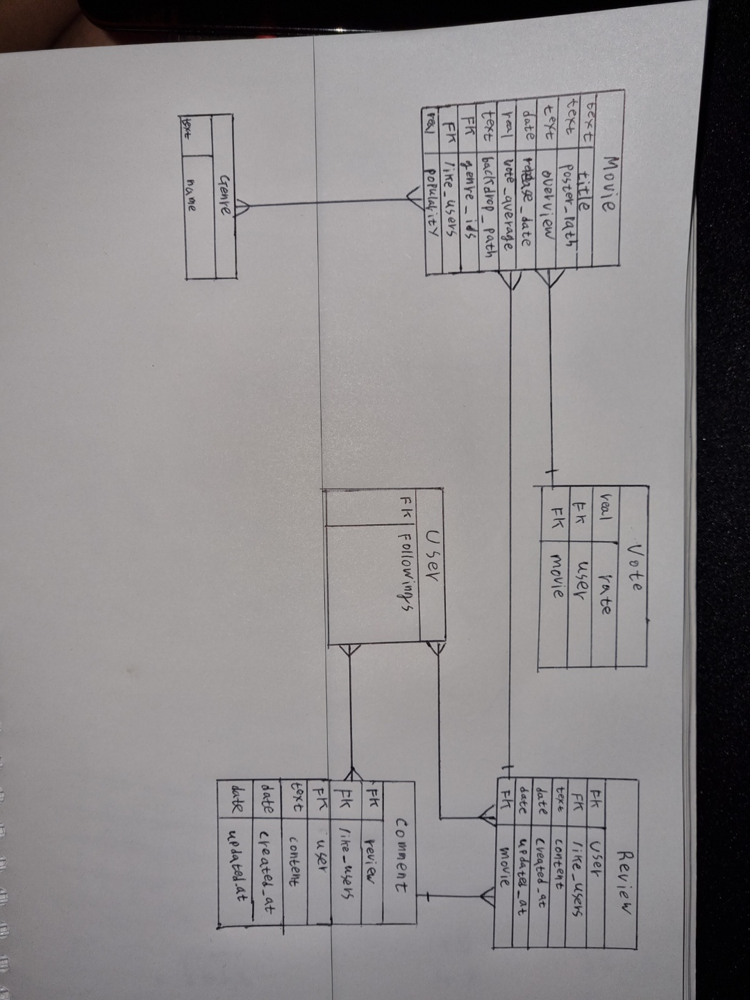

# FINAL PJT

>  ### 컴포넌트 구조 & 모바일 대응을 위한 반응형 웹

- HomeView.vu
  - 각각 container, row로 class가 지정된 div 태그 안에 col-12을 가진 홈페이지 타이틀과 서치폼이 있다.
  - 하단의 장르 / 년도 선택 폼 / 영화 포스터 영역은 각각 컴포넌트 안에서 그리드 설정을 해주었다.
- GenreYearForm.vue
  - 장르 / 년도 선택 폼은 전체적으로 부트스트랩의 아코디언 폼으로 묶어주었다.
  - 타이틀인 'SEARCH'는 col-12로 지정하였다.
  - 하단 아코디언 바디에 속하는 모든 라디오 버튼들은 세로로 2개씩 묶이도록 div 태그로 감싸주었다. 라디오 버튼이 총 19개라 남는 1개의 라디오 버튼이 생기지 않도록 하나의 div 태그만 3개의 라디오 태그로 감싸져 총 9개의 div 태그가 있다.
  - 각 9개의 태그들은 화면 비율이 작아질때마다 차지하는 비율이 작아질 수 있도록 xl-1, md-3로 설정, 가장 작은 화면에선 -4로 설정하여 가장 작은 화면에선 세로로 3줄이 출력되도록 하였다. 이렇게 하여 버튼과 텍스트 사이가 충돌되지 않고 모바일 화면 안에서 구현될 수 있었다.
- MovieListView.vue
  - 각 영화를 for문으로 돌려 호출하고, 각 container, row로 지정된 div 태그 안에 넣어서 col 값을 가지도록 설정하였다. 이 각각의 포스터 이미지들은 화면 비율에 따라 갯수가 달리 출력될 수 있도록 sm-6 md-4 lg-3 xl-2로 설정하여 가장 큰 화면에선 6개가 출력, lg 크기에서 4개, md 크기에서 3개, 작은 화면에선 2개가 출력된다.
- EmotionView.vue
  - 상단에 페이지를 소개하는 짧은 글과 버튼, 그리고 눈에는 보이지 않지만 약간의 공간을 차지하는 div 태그 총 3개의 요소가 존재한다. 이 요소들은 각각 col 값을 차지하고 그 바깥에 각 container, row로 class가 지정된 div 태그로 묶여 있다.
  - 큰 화면에선 페이지 소개 글이 가장 큰 자리를 차지할 수 있도록 col-7 값, 버튼은 4 값, 그리고 눈에 보이지 않지만 1만큼의 자리를 차지하는 div 태그 이렇게 설정하였다.
  - 화면이 작아지면 이 각 요소들이 뭉쳐서 보이지 않도록 각각 md-12 값을 설정하여 가로로 한 줄씩 차지할 수 있도록 하였다.
  - 하단의 영화 포스터 이미지들은 위의 MovieListView.vue에서 그리드 설정을 미리 해주어 함께 반응형 웹페이지를 구성하고 있다.
- ShuffleView.vue
  - 상단의 소개글이 화면의 왼쪽 구역에서 넓은 공간을 차지하도록 각 container, row로 class가 지정된 태그 안에 넣고, col-7값을 설정하였다. 그 오른쪽엔 col-5 값을 가진 빈 태그를 넣어두었고, 모바일 화면으로 변경되면 왼쪽의 소개글이 작아지지 않도록 col-md-12로 설정하였다.
  - 하단의 영화 검색 부분과 영화 포스터 영역은 각각의 vue 파일에서 그리드 설정하였다. 영화 포스터 영역은 위의 MovieListView.vue를 참조하면 된다.
- DetailMovieView.vue
  - 총 4개의 col을 가진 div 태그들이 각각 class container, row로 지정된 큰 태그들 안에 있다. 2개의 태그는 각각 영화 포스터와 영화 정보이고, 나머지 2개는 각각 리뷰 작성 폼, 리뷰 보여주는 영역이다. 영화 포스터와 영화 정보는 가로로 같이 보여주기 위해 각 col-lg-6으로 설정하였다. 그래서 lg 이상의 화면에서는 50%의 화면 비율로 각각 나오게 되는데, 이하의 작은 화면 비율에서는 화면 전체로 구성할 수 있도록 col-12를 추가적으로 작성해주었다.
  - 하단의 리뷰 작성 폼과 리뷰 보여주는 영역은 독립적으로 가로 공간을 차지할 수 있도록 col-12를 입력해주었다.
- SearchForm.vue
  - 이 vue 파일은 ShuffleView.vue 중앙부에 위치한 컴포넌트 영역이다.
  - 왼쪽 검색창, 중간 버튼, 오른쪽 검색창 총 3개의 영역으로 구성되고 이 3개를 가로로 나란히 보여주기 위해 각자 col을 부여했다. 중간 버튼은 작게, 왼쪽 오른쪽 검색창은 동일한 비율로 보여주기 위해 버튼은 col-md-2, 검색창들은 col-md-5로 설정했다.
  - 화면 비율이 작아지면 서로 겹쳐져 충돌하는 일이 없게 md 사이즈 이하의 크기에는 col-12 가로 영역 전체로 설정해주었다.
- NavBar.vue
  - 부트스트랩 내장 nav 클래스를 지정하였다. 여기서는 별다른 그리드 클래스를 주지 않아도 자동으로 버튼안으로 메뉴가 들어가 반응형 웹사이트를 구현할 수 있었다.
- ProfileView.vue
  - 로그인한 유저가 좋아요를 누른 영화, 작성한 리뷰, 작성한 댓글을 나란히 보여주기 위해 class로 card가 지정된 div를 3개를 배치하였다.
  - 각 col-4를 입력하여 동일한 크기로 삼등분 배치가 되었다.
  - 화면 비율이 작아지면 좋아요를 누른 영화 페이지부터 보일 수 있게 col-lg-4, col-12를 작성하여, lg 화면 비율 이하로 작아지면 가로로 각각의 자리를 차지할 수 있도록 하였다.

### 1.팀원 정보 업무 분담 내역

- 이건희
  - 백엔드(DRF로 API서버구축)
  - 프론트엔드(vue 기능구현 및 웹페이지 레이아웃 구현)

- 박소정
  - 웹디자인
  - 웹 퍼블리싱

### 2.목표 서비스 구현 및 실제 구현 정도

- 백엔드 & 프론트엔드

  - 1일차 장고
    - 모델링 완료(추후 필요한 데이터 있다면 수정하면됨) Acoounts -유저정보 요청하는 api 구현 
    - 유저 팔로우기능 구현 api 및 함수 구현
    - 리뷰 CRUD  api 및 함수 구현 
    - 리뷰 좋아요 기능 api 및 함수 구현
    - 댓글 CRUD api 및 함수 구현
    - 댓글 좋아요 기능 api 및 함수 구현
    - 영화 제목으로 검색 api 및 함수 구현
    - 영화 장르와 연도 둘모두 쓰거나 하나만 써서 검색하는 기능 api 및 함수 구현 
    - 기분으로 추천하는 알고리즘 api 및 함수 구현 
    - 영화 2개 합쳐서 랜덤 추천 api 및 함수 구현
    - 영화 좋아요 누르기 api 및 함수 구현 
    -  인기영화 20개 구현은 했는데 매일 api 새로 요청해서 DB에 저장해야하는데 이부분 아직 해결이 안되서 일단은 덤프데이터로 만들어서 DB에 넣어둠 fictures에 영화, 장르, 인기영화 제이슨 덤프파일로 만들어둠
    - 모델 및 시리얼라이저 및 뷰함수 api요청에 맞게 수정
  - 1일차 뷰
    - profile 페이지 구현
    - 리뷰, 댓글 보여주는 부분 구현
    - 영화 제목 기반 검색 기능 구현
    - 영화 제목 기반 연관검색어 기능 구현
    - 디테일페이지 구현
  - 1일차 CSS
    - 로그인폼 / 사인업 / 프로필 폼 전반적인 레이아웃 구축
    - 인덱스 홈페이지 전반적인 레이아웃 구상
  
  
  ---
  
  - 2일차 장고
    - 제목기반 디테일 영화정보 리턴하는 url 및 함수 추가작성
    - 인기영화 20개를 매일 갱신하는 것 보다 차라리 역대 관람객 수 기준으로 20개의 영화를 가져와서 띄워주는게 낫다고 판단 수정
    - 감정기반 영화추천 api 및 함수 구현
    - 리뷰 삭제, 댓글 작성 댓글 삭제 api 및 함수 구현
  - 2일차 뷰
    - 디테일페이지 새로고침시 데이터 날아가는 현상 수정
    - 리뷰조회 및 작성기능 추가
    - 홈에 역대 명작 20개 띄우기 구현
    - 포스터 누르면 디테일 페이지 띄우기 구현
  - 2일차 CSS
    - 인덱스 홈페이지 전반적인 레이아웃 구현
    - 반응형 웹페이지 위한 그리드로 각 페이지의 요소들 크기 조정
    - 디테일 페이지 전반적인 레이아웃 구현
    - 로그인 / 사인업 페이지 전반적인 디자인
      - 오류메시지 포함 그리드 구현
  
    - 감정 기반 페이지 전반적인 레이아웃 구현
  

  ---

  - 3일차 장고
    - 평점 모델링 추가
    - 평점 CRUD구현
  - 3일차 뷰
    - 영화 좋아요 누르기 구현 및 좋아요 누른 사람 수 표시하기 구현
    - 프로필페이지에서 작성한 리뷰, 댓글, 좋아요한 영화 보이기 구현
    - 리뷰나 좋아요 한 영화는 프로필페이지에서 클릭하면 해당 영화 디테일 페이지로 이동하게 라우터 구현
    - 리뷰 작성자 누르면 작성자의 프로필 페이지로 이동하게 구현
    - 다른사람 프로필페이지에서 내프로필가기 누르면 url만 바뀌고 계속 상대 프로필 뜨는 현상 수정
    - 평점 CRUD구현
  - 3일차 CSS
    - 디테일 페이지에 보이는 각 요소들 전반적인 디자인 및 그리드화
    - 프로필 페이지에 보이는 각 요소들 전반적인 디자인 및 그리드화
    - 감정 기반 페이지, 로그인 / 사인업 페이지 디자인 수정
  
  
  ---
  
  - 4일차 장고
    - 댓글, 리뷰 CUD시 MovieSerializer로 해당 영화 정보 제공하게 바꿈 
  - 4일차 뷰
    - 셀프 디도스현상 수정
    - 댓글, 리뷰의 업데이트기능 추가함으로 CRUD 모두 구현
    - 장르와 연도기반 검색 기능 구현
    - 셔플 추천 구현
  - 4일차 CSS
    - 리뷰, 댓글 수정 버튼 클릭 시 팝업되도록 수정
    - 카드 컴포넌트 디자인 수정(타이틀 보이도록)
    - 장르와 연도기반 검색 기능 디자인 및 반응형 그리드로 설정
    - 다른 웹에서도 요소가 깨지는지 확인 후 수정
    - 셔플 페이지 전반적인 레이아웃 구현
  
  
  ---
  
  - 5일차 뷰
    - 아코디언에 id값 부여해서 각각 따로 열리도록 수정
    - 좋아요 누른 유저인지 체크하는 함수 수정
  - 5일차 CSS
    - 반응형 웹페이지 전반적인 그리드 수정
    - 디테일 페이지 좋아요 버튼 수정
    - 셔플 페이지 디자인 수정
  
  
  ---
  
  - 6일차
    - 서버 cloud9 프론트 Netlify를 활용해서 배포 성공
    - 프로필에서 이미 팔로우 중인지 체크하는 함수 작성
    - 프로필 페이지의 댓글리스트 수정 
    - 전반적인 CSS 디자인 수정
    - 모바일 버전 반응형 웹페이지 전반적인 수정
      - 리뷰/ 댓글 아코디언 폼에서 깨지는 오류 발견 후 수정
      - 모바일에서 생기는 애매한 공백 수정
    - 리뷰 / 댓글 생성 /수정 시각 포함 수정
  
  ------
  
  - 7일차
  
    - 전반적인 CSS 디자인 수정 및 오류 점검
  
    - 프레젠테이션 위한 파워포인트 자료, 영상 제작
  
    - 수정 버전 재배포
  
      

### 3. 데이터 모델링

### 4. 필수 기능에 대한 설명

1. 홈화면에 데이터베이스에 담긴 영화의 관람객 기준 내림차순으로 24개의 영화 띄워줌
2. django admin을 활용하여 관리자 페이지 구현
3. 영화 데이터  9988개 수집
4. 로그인 유저는 영화의 디테일 페이지에서 평점, 리뷰, 좋아요의 CRUD가능
5. 유저가 현재 자신의 기분을 선택하면 그 기분에 맞는 장르의 영화에서 랜덤으로 24개를 띄워주는 Emotion 추천 기능 구현
6. 유저가 2가지의 다른 영화를 선택하면 두영화의 장르를 섞어서 랜덤으로 24개를 띄워주는 shuffle 추천 기능 구현
7. 영화 제목으로 검색 기능에서 연관검색어 기능 구현
8. 장르 및 연도로 검색 기능 구현

### 5. 배포 서버 URL

https://master--incandescent-cendol-7d2a2c.netlify.app/

### 6. 기타 느낀점

박소정 : 정말 순식간에 지나간 프로젝트 일주일이었습니다. 엊그제 시작한거 같은데 시간이 매우 빠르게 지나가 어느새 마무리를 지어야하는 단계가 온 것이 새삼 신기하게 느껴지고, 그 시간 동안 많은 것을 배울 수 있어 뜻 깊은 순간이었습니다. 더 잘하지 못해 아쉬운 부분, 어떻게 작성해야할지 모르겠어서 막막했던 감정, 그래도 막혔던 문제를 스스로 풀어내 뿌듯했던 시간, 밤새워가며 무언가에 몰두해 결과물을 만들었다는 성취감 등 복합적인 감정이 이제 프로젝트를 마무리할때쯤 되니 느껴집니다. 이번 프로젝트가 제겐 쉽지 않아 앞으로 더 빡세게 흘러갈 2학기가 걱정되기도 하지만, 이번 프로젝트를 통해 얻은 것이 많아 앞으로 더 잘해야겠다는 다짐을 하게 되었습니다. 

이건희 - 처음에는 이걸 정말 할수 있을까라는 생각이 들고 막막하였지만 차근차근 기능을 하나씩 구현해나가다 보니 어느새 서버를 완성하고 뷰에 기능을 구현하고 최종적으로 서버배포까지 할 수 있었습니다. 그렇게까지 획기적이거나 고차원의 알고리즘을 사용한것은 없었지만 개발과정에서 백엔드부터 프론트엔드 배포까지 진정한 풀스택이 어떤것인지 약간이나마 체험할 수 있는 기회였습니다. 또한 원하는 기능을 구현하기 위하여 마주하였던 많은 오류들을 해결하기 위해 구글링을하고 스택오버플로우를 비롯한 여러 사이트에서 도움을 얻으며 필요한 정보를 찾고 적용하는 능력을 기를 수 있었습니다. 검색으로 해결이 안되어서 배운것을 바탕으로 여러 방법으로 우회해가며 구현할 때는 배운것이 헛되진 않았다는 느낌을 받아 기쁘기도 하였습니다.

많이 힘들기도 하였지만 깃브런치, 구글링 실력, 뷰엑스의 기능에 대한 이해를 크게 쌓을 수 있는 좋은 기회였던것 같습니다.